# Image Stitching
## OpenCV based Image Stitching applied various method in C++
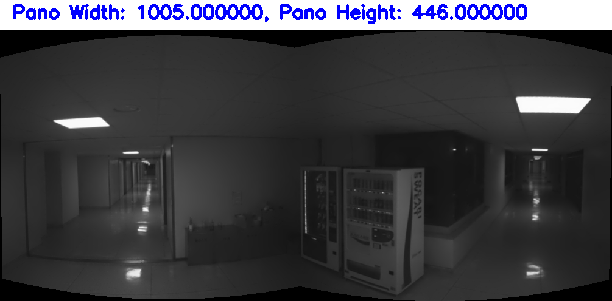

## 1. Prerequisites
### 1.1 Dependencies
OpenCV 4.8.0, OpenCV Contrib 4.8.0, C++ 11 version \
- If you already use OpenCV Version 3.x.x, then only change `cv::SIFT` to `cv::xfeatures2d::SIFT` !! 

### 1.2 **Ubuntu** and **ROS**
Follow [ROS Installation](http://wiki.ros.org/ROS/Installation)
- This code tested Ubuntu 64-bit 18.04 (ROS Melodic Version).

### 1.3. **OpenCV Installation**
Follow [OpenCV](https://docs.opencv.org/4.x/d2/de6/tutorial_py_setup_in_ubuntu.html)
- Install appropriate OpenCV version: [Here](https://heathered-freon-621.notion.site/Opencv-How-to-install-appropriate-OpenCV-version-86275642fc924df5b1c258f077a94387).

### 1.4 **Intel RealSense ROS package and SDK**
Follow [realsense-ros](https://github.com/IntelRealSense/realsense-ros)

## 2. Get Custom Dataset
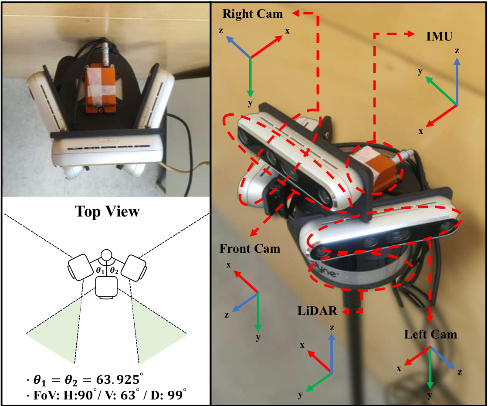

Follow [KAIST-DP](https://github.com/SungJaeShin/KAIST-DP.git) Dataset
  - Intel Realsense D455 x3
  - Xsens MTI-300 IMU
  - Velodyne LiDAR VLP 16

## 3. Methodology to apply image stitching
- Reference Codes
    - Feature Extraction & Descriptor & Matcher & Outlier Rejection
        - Use this Github Page &rarr; [Feature Matching](https://github.com/SungJaeShin/Feature_matching.git)
    - Parallax
        - Use this Github Page &rarr; [Parallax](https://github.com/SungJaeShin/Parallax.git)
---
- **Histogram Equalization**
    - [1] Vanilla
    - [2] CHALE

- **Feature Extraction**
    - [1] ORB
    - [2] goodFeaturesToTrack
    - [3] SIFT

- **Feature Descriptor**
    - [2] DAISY

- **Feature Macher**
    - [1] Brute-Force Matcher (BF)

- **Matching**
    - [1] knn match (KNN)

- **Outlier Rejection**
    - [1] findFundamentalMatrix (FM)
    - [2] Parallax
    - [3] Optical Flow 

- **Stitching Base**
    - [1] Camera Parameter Setting
    - [2] Image Masking
    - [3] Pre-check OpenCV Errors

- **Fast Stitching Method**
    - Feature Matcher &rarr; cv::detail::BestOf2NearestMatcher
    - Camera Estimator &rarr; cv::detail::HomographyBasedEstimator
    - Bundle Adjustment &rarr; cv::detail::BundleAdjusterRay
    - Warping &rarr; cv::SphericalWarper
    - Exposure &rarr; cv::detail::GainCompensator
    - Seam &rarr; cv::detail::DpSeamFinder
    - Blender &rarr; cv::detail::MultiBandBlender

- **Direct Stitching Method based Homography** (in `warping.h`, `imgproc.h`) 
    - OpenCV based stitching &rarr; cv::warpPerspective
    - Not use OpenCV stitching &rarr; cv::findHomography
  
## 4 **Changing Parameters**
### Parameters in "paramsetting.h"
```
#define SEE_MASKING
/* Visualize masking image (opencv_setting.h)
   Not see masking result -> 0 & See masking result -> 1 */

#define MASKING_REAL
/* Visualize masking in real image or white image (visualization.h)
   To see results in white image -> 0 & To see results in real image -> 1 */

#define SAVE_SYNC_IMG_WITH_TIME 
/* Visualize sync image with time (visualization.h)
   Not see sync result -> 0 & See sync result -> 1 */

#define SAVE_IMGS_WITH_FEATURES
/* Visualize image with features (visualization.h) 
   Not see image result with features -> 0 & See image result with features -> 1 */

#define SAVE_IMGS_DESCRIPTOR_MATCHING 
/* Visualize image with feature matching (visualization.h) 
   Not see image matching result -> 0 & See image matching result -> 1 */

#define RESIZE 
/* Resize result of panorama image (stitching.cpp)
   Not resize panorama image -> 0 & Resize panorama image -> 1 */

#define FLOW_BACK
/* Optical flow reverse check (parallax.h)
   Not use reverse check -> 0 & Use reverse check -> 1 */

#define HIST_EQUA 
/* Use Histogram Equalization (preprocessing.h)
   Not use histogram equalization -> 0 & Use histogram equalization -> 1 */

#define USE_CHALE 
/* Use CHALE Histogram Equalization (preprocessing.h) 
   Not use CHALE histogram equalization -> 0 & Use CHALE histogram equalization -> 1 */

#define FAST_STITCHING 
/* Use Fast Stitching (stitch.h)
   Not use fast stitching -> 0 & Use fast stitching -> 1 */

#define METHOD 
/* Debug OpenCV Error (error_filter.h)
   ORB Feature + BF Matching w/ Hamming distance -> 0
   SURF Feature + FLANN Matching w/ KNN -> 1
   SURF Features + FLANN Matching w/ KNN + Masking -> 2 */

#define MODE 
/* Stitching Mode (stitch.h)
   Vanilla -> 0
   Camera Intrinsic -> 1
   Camera Intrinsic + Masking -> 2
   Camera Intrinsic + Masking in estimateTransform function -> 3 */
```

## 5. Build Stitching_Image
Clone the repository and catkin_make:
```
    $ cd ~/catkin_ws/src
    $ git clone https://github.com/SungJaeShin/Image_Stitching.git
    $ cd ../
    $ catkin build
    $ source ~/catkin_ws/devel/setup.bash
```

## 6. Run two cameras
```
    $ roslaunch image_stitching multi_cam.launch
    $ rosrun image_stitching stitching_node
    $ (option) rviz 
```

## 7. Results
- Test Pair (EuRoC dataset) 
  <table>
      <tr>
         <td> Img1 </td>
         <td> Img2 </td>
      </tr> 
      <tr>
         <td>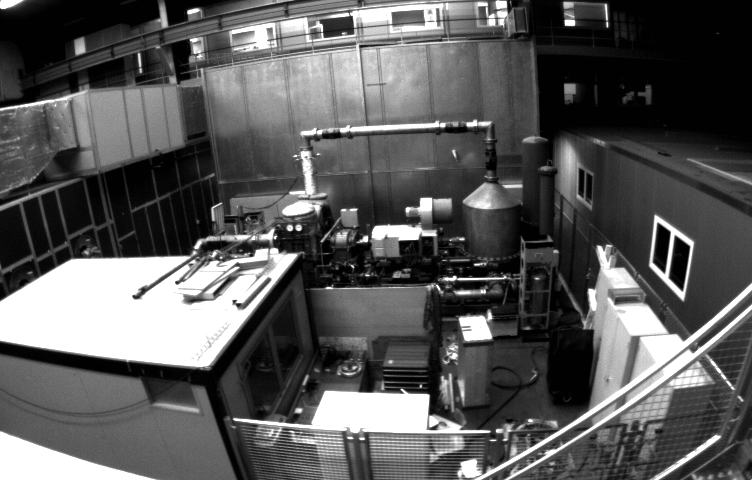 </td>
         <td>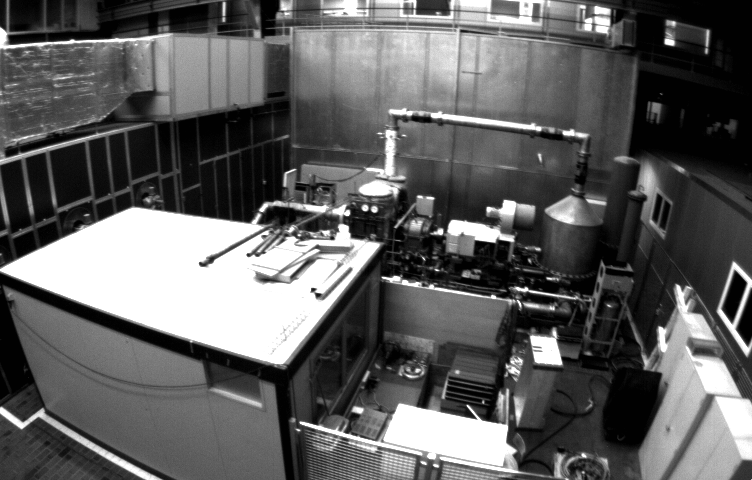 </td>
      </tr>
  </table>

- Feature Matching using test pair
  <table>
      <tr>
         <td> SIFT features + DAISY descriptors + BF Matcher + KNN Matching </td>
      </tr> 
      <tr>
         <td>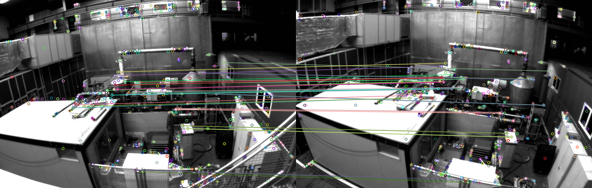 </td>
      </tr>
  </table>  

- OpenCV Stitching using test pair
  - Original stitching (**About 4.0 Sec**) &rarr; Graph Cut Seam Finding Method + Block Gain Compensator Method
  - Fast stitching (**About 0.9 Sec**) &rarr; Dynamic Programming Seam Finding Method + Gain Compensator Method

  <table>
      <tr>
         <td> Original Auto Stitching </td>
      </tr> 
      <tr>
         <td>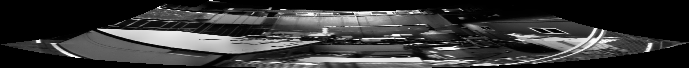 </td>
      </tr>
      <tr>
         <td> Fast Stitching </td>
      </tr> 
      <tr>
         <td>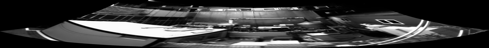 </td>
      </tr>
  </table>

- Img warping using test pair (additionally using Interpolation method)
  <table>
      <tr>
         <td> Img2 warp using cv::warpPerspective </td>
         <td> Img2 not using cv::warpPerspective </td>
      </tr> 
      <tr>
         <td>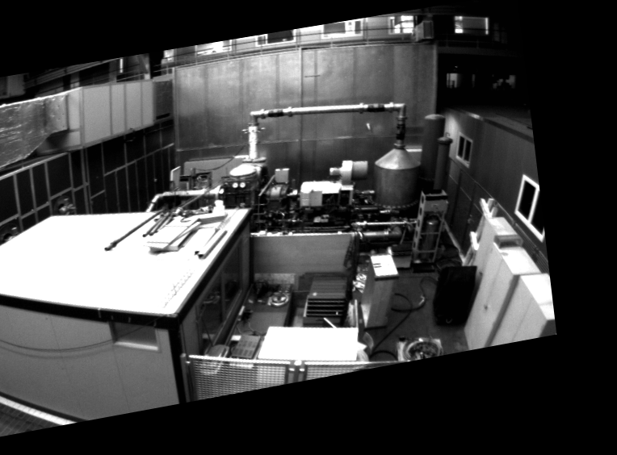 </td>
         <td>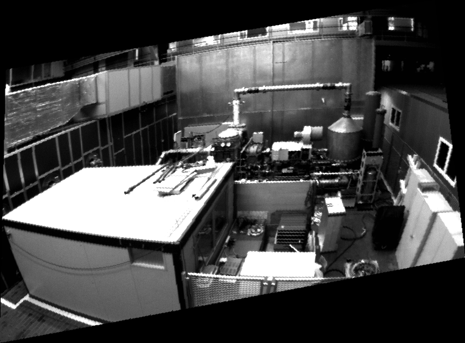 </td>
      </tr>
  </table>

- Direct Stitching using test pair
  - OpenCV Warp API stitching (**About 0.02 Sec**) 
  - Not use OpenCV Warp API stitching (**About 0.37 Sec**)

  <table>
      <tr>
         <td> Img1 + Img2 warp using cv::warpPerspective </td>
         <td> Img1 + Img2 not using cv::warpPerspective </td>
      </tr> 
      <tr>
         <td>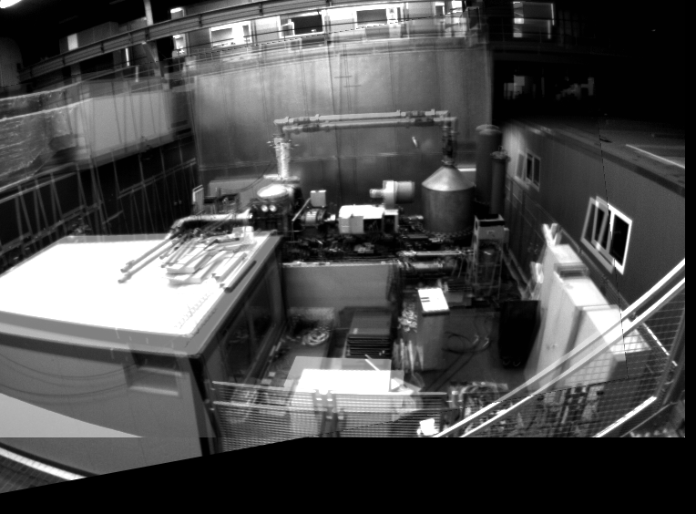 </td>
         <td>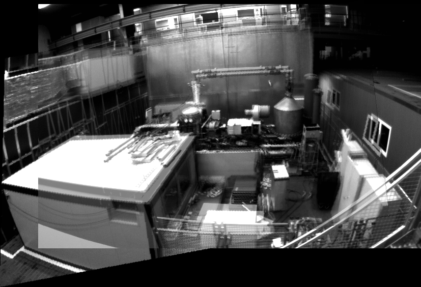 </td>
      </tr>
  </table>  

- Convert Plane image to polar image using OpenCV API
  <table>
      <tr>
         <td> Polar Img (cv::linearPolar) </td>
         <td> Log Polar Img (cv::logPolar) </td>
      </tr> 
      <tr>
         <td>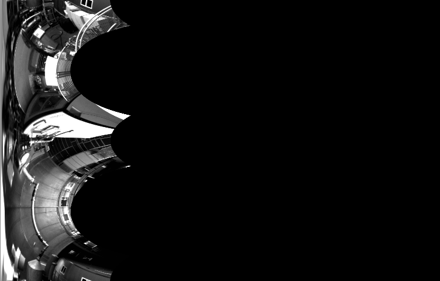 </td>
         <td>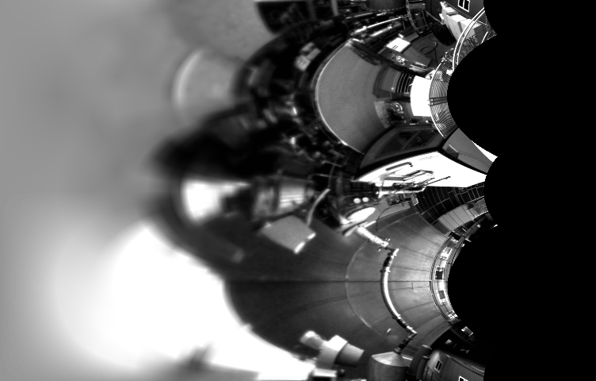 </td>
      </tr>
  </table>  

## 8. Save panorama image in your PC
Change eight variables **"save_match1_dir, save_match2_dir, save_orb_dir, save_sync_dir, save_img1_dir, save_img2_dir, save_img3_dir, save_pano_dir"** in this package !!

## 9. Reference 
[1] [https://github.com/SungJaeShin/Feature_matching.git](https://github.com/SungJaeShin/Feature_matching.git) \
[2] [https://github.com/SungJaeShin/Parallax.git](https://github.com/SungJaeShin/Parallax.git) \
[3] [https://github.com/SungJaeShin/KAIST-DP.git](https://github.com/SungJaeShin/KAIST-DP.git) \
[4] [https://docs.opencv.org/3.4/dc/d6b/group__video__track.html#ga473e4b886d0bcc6b65831eb88ed93323](https://docs.opencv.org/3.4/dc/d6b/group__video__track.html#ga473e4b886d0bcc6b65831eb88ed93323) \
[5] [https://docs.opencv.org/3.2.0/da/d54/group__imgproc__transform.html#ga5bb5a1fea74ea38e1a5445ca803ff121](https://docs.opencv.org/3.2.0/da/d54/group__imgproc__transform.html#ga5bb5a1fea74ea38e1a5445ca803ff121) \
[6] [https://docs.opencv.org/4.x/d6/dc7/group__imgproc__hist.html#ga7e54091f0c937d49bf84152a16f76d6e](https://docs.opencv.org/4.x/d6/dc7/group__imgproc__hist.html#ga7e54091f0c937d49bf84152a16f76d6e) \
[7] [https://docs.opencv.org/4.x/d6/dc7/group__imgproc__hist.html#gad689d2607b7b3889453804f414ab1018](https://docs.opencv.org/4.x/d6/dc7/group__imgproc__hist.html#gad689d2607b7b3889453804f414ab1018) \
[8] Y. Xiong and K. Pulli, "Fast panorama stitching for high-quality panoramic images on mobile phones," in IEEE Transactions on Consumer Electronics, vol. 56, no. 2, pp. 298-306, May 2010, doi: 10.1109/TCE.2010.5505931.

